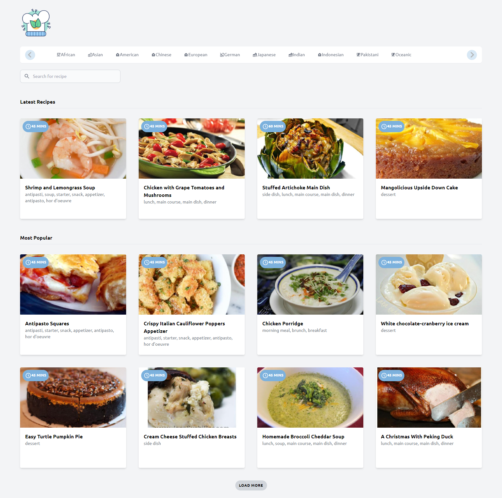

## Recipe App

## Available Script

In the project directory, you can run:

### `npm start`

Runs the app in the development mode.\
Open [http://localhost:3000](http://localhost:3000) to view it in your browser.

The page will reload when you make changes.\
You may also see any lint errors in the console.

## Technologies Used

This project was built using the following technologies:
React
Spoonacular API
Tailwind CSS

## Environment Variables

This app uses environment variables to securely store sensitive information such as API keys. To set up the .env file, follow these steps:

Create a new file in the root directory of your project called .env
Add the following environment variables to the .env file, replacing the values with your own:

### `REACT_APP_API_KEY=<your_api_key_here>`

Save the .env file and run the server again.

## TODO

TODO: This code is not optimized and needs refactoring for better performance and readability.
Also have some snacks ready, because you might end up like me, feeling incredibly hungry after coding this app!
